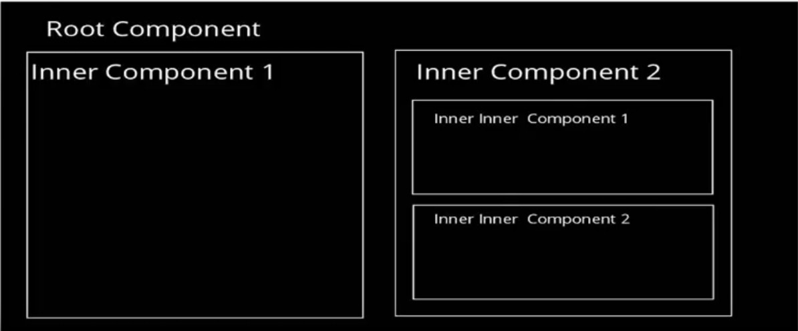
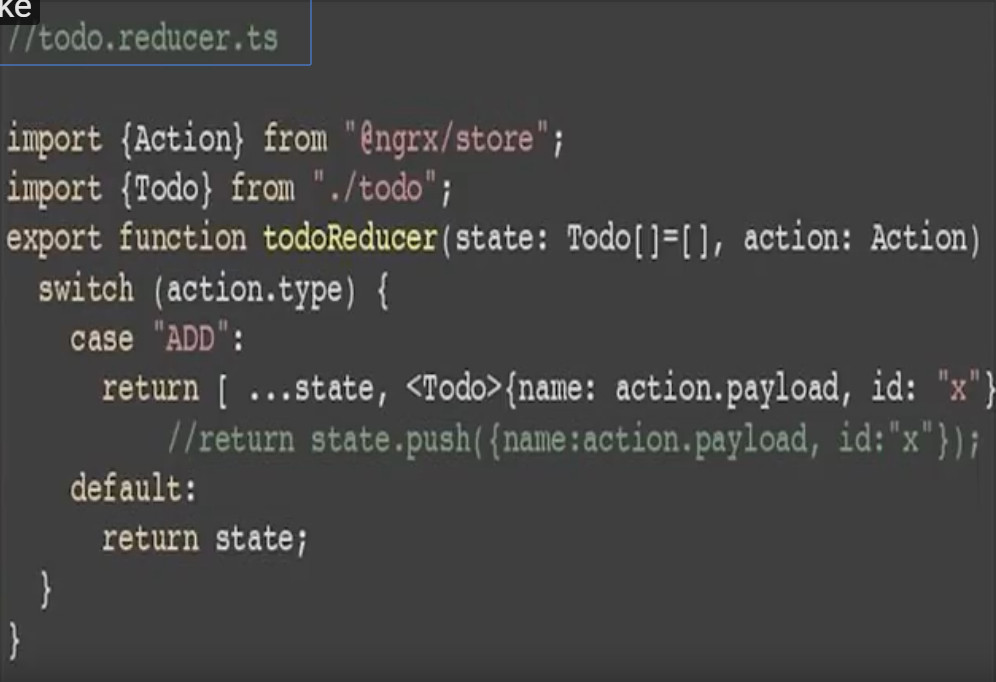
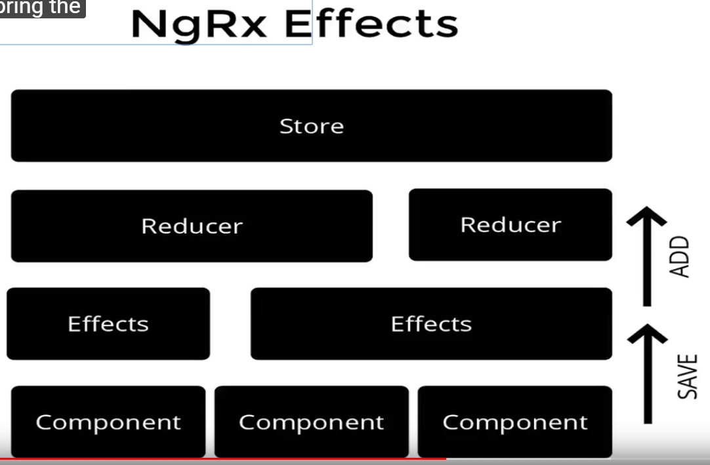
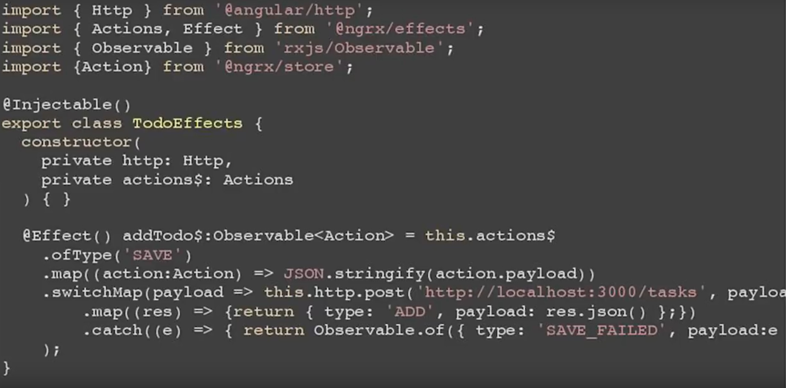

# NGRX learn

> With angular2 we have a lot of components and you probably have a root component and within their inner components . One of the problems is that rendering the components every time the data change might be expensive , The reason I got to use this framework is we had a quite a complex single page application where we were having a quite a complex model and if you change the data in one part of the model it would then change nultiple views .

> angular also give us the ability to configure or give us control of their change detection strategy . So essentially you can acturally manually configure a component to render only if you know something is changing 

## ngrx effect

> Another valid question is that's very good but usually our system is communicating with a lot of services and these services are not in our normal code or if we're doing like a back-end system which can talk directly to the resources that also can introduce delays so those are essentially all side effects for our application . How we deal with side effects? traditionly in your view component itself you could implement your or call your those various services using like HTTP for web service and then get the response and then pass the data onto your reducer . 

But essentially if you want to introduce a bit of separation of concern, you can basically bring the effects as a separate layer , so essentially what would happen then is from you component you could pass an action to the effects.  After they actually make the call , effects then pass the fata to the reducer and then manipulate the state of our application .

 We can have effects across components same way reducers does . we have to create an injectable service(与 http service 一样，effect 是一个服务)  and we have to use the effect annotation and in this case 'addTodo' . Basically actions is also an observable .  ofType will check is the type is 'action.payload' . Then we map our action to a string file JSON object and then we use of switchmap . Once we get the result we map the result into another action which is going to be 'type: ADD' . Then we're going to pass the actual object 