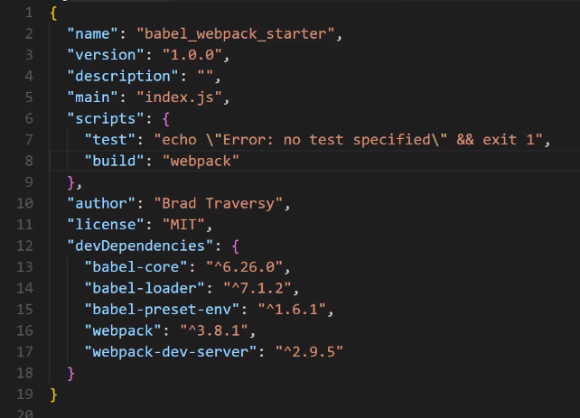

# Use Babel & Webpack To Compile ES2015 - ES2017

`课程来源`

https://www.youtube.com/watch?v=iWUR04B42Hc


## 配置基本的目录结构 

```bash
mkdir babel_webpack_starter

npm init

npm install --save-dev webpack webpack-dev-server babel-core babel-loader babel-preset-env

# webpack config file
touch webpack.config.js

```

 跟课的时候，一定要跟着版本走，才不去去犯各种各样的错误；


```json

// following cousers have to install specific release of libraries;
{
  "name": "babel_webpack_starter",
  "version": "1.0.0",
  "description": "",
  "main": "index.js",
  "scripts": {
    "test": "echo \"Error: no test specified\" && exit 1",
    "build": "webpack",
    "start": "webpack-dev-server --output-public-path=/build/"
  },
  "author": "",
  "license": "ISC",
  "devDependencies": {
    "babel-core": "^6.26.0",
    "babel-loader": "^7.1.4",
    "babel-preset-env": "^1.6.1",
    "webpack": "^3.8.1",
    "webpack-dev-server": "^2.9.5"
  },
  "dependencies": {}
}


```

```bash
# 用来显示 编译报错原因
webpack --display-error-details`

```

```js
// webpack.config.json


const path = require('path');

module.exports = {
    entry: {
        app: './src/app.js'
    },
    output: {
        path: path.resolve(__dirname, 'build'),
        filename: 'app.bundle.js'
    },
    module: {
        loaders: [{
            test: /\.js?$/,
            exclude: /node_modules/,
            loader: 'babel-loader',
            query: {
                presets: ['env']
            }
        }]
    }
}

```

> test this config

```bash
mkdir src
cd src
touch app.js

+ src
| + app.js

vi app.js

```

## 解决使用es 2017 async 函数的bug


> to fix this we need babel-polyfill

* install babel polyfill and necessary preset

```bash
npm install --save-dev babel-polyfill babel-preset-stage-0

```

* config webpack config file

```js

const path = require('path');

module.exports = {
    // config entry item  babel-ployfill
    entry: {
        app: ['babel-ployfill','./src/app.js']
    },
    output: {
        path: path.resolve(__dirname, 'build'),
        filename: 'app.bundle.js',
        // sourceMapFilename: "bundle.js.map",
    },
    module: {
        loaders: [{
            test: /\.js?$/,
            exclude: /node_modules/,
            loader: 'babel-loader',
            // config babel presets
            query: {
                presets: ['env','stage-0']
            }
        }]
    }
}

```


##  在线去测试 restFull json api: 特别的重要；

Fake Online REST API for Testing and Prototyping 
powered by JSON Server and lowdb

https://jsonplaceholder.typicode.com/